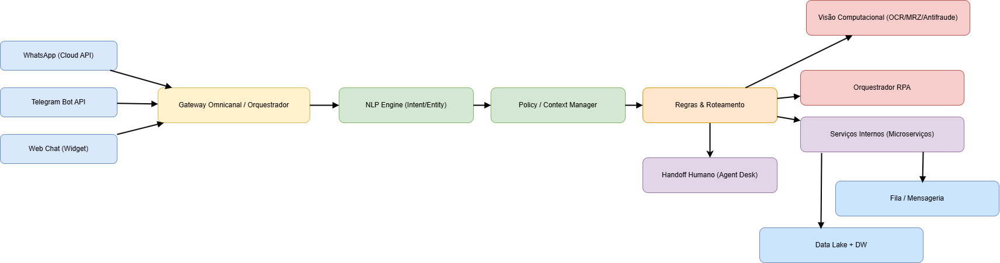

# FIAP - Faculdade de Informática e Administração Paulista

<p align="center">
<a href="https://www.fiap.com.br/"></a>
</p>

<br>

# YOUVISA – Plataforma Inteligente de Atendimento Multicanal (Sprint 1)
## Beginner Coders
## 👨‍🎓 Integrantes:
- <a href="https://www.linkedin.com/in/luana-porto-pereira-gomes/">Luana Porto Pereira Gomes</a>
- <a href="https://www.linkedin.com/in/luma-x">Luma Oliveira</a>
- <a href="https://www.linkedin.com/in/priscilla-oliveira-023007333/">Priscilla Oliveira </a>
- <a href="https://www.linkedin.com/in/paulobernardesqs?utm_source=share&utm_campaign=share_via&utm_content=profile&utm_medium=ios_app">Paulo Bernardes</a>

## 👩‍🏫 Professores:
### Tutor(a)
- <a href="https://www.linkedin.com/in/leonardoorabona/">Leonardo Ruiz</a>
### Coordenador(a)
- <a href="https://www.linkedin.com/in/profandregodoi/">André Godoi</a>
## 📜 Descrição do Projeto
Este repositório contém a **proposta técnica inicial** da plataforma **YOUVISA** para um **atendimento cognitivo multicanal** (WhatsApp, Telegram, Web) com **NLP**, **RPA**, **visão computacional** para validação documental e **arquitetura cloud** escalável.  
Esta entrega foca em **escopo, arquitetura, fluxos e governança**.
## 🎯 Objetivos da Sprint 1
- Definir **arquitetura técnica** (cloud, APIs, serviços de NLP/RPA) e **pipeline de dados**.  
- Desenhar **fluxos do chatbot** (Telegram como diferencial; integração desejável com WhatsApp).  
- Especificar **coleta/tratamento de dados** (simulada) e **estratégia de segurança LGPD**.  
- Definir **encaminhamento para humano** e **métricas/KPIs**.  
- Organizar **plano de desenvolvimento** e **RACI**.
## 💡 Problema & Solução (Resumo Executivo)
**Problema:** organizações lidam com alto volume de solicitações de vistos/consulares, triagens repetitivas e verificações documentais que geram **custos** e **atrasos**.  
**Solução:** plataforma multicanal com **chatbot cognitivo** + **automação de processos (RPA)** + **validação de documentos via visão computacional**. O atendimento mantém **continuidade entre canais**, garante **segurança (LGPD)** e **handoff para humano** quando necessário.
## 🧠 Arquitetura (alta visão)
A arquitetura contempla:
<p align="center">
<a href=""></a>
</p>

A arquitetura da solução **YOUVISA** representa o fluxo inteligente de atendimento multicanal, onde diferentes pontos de contato do usuário (como **WhatsApp**, **Telegram** e **Web Chat**) se integram de forma fluida a um núcleo cognitivo capaz de compreender intenções, automatizar processos e garantir continuidade entre canais.

---

### 1. Canais de Entrada  
Os canais representam as **portas de entrada do usuário**.  
Cada interação, seja por **WhatsApp (Cloud API)**, **Telegram Bot API** ou **Web Chat**, é capturada e encaminhada ao **Gateway Omnicanal**, que centraliza e padroniza as mensagens recebidas.  
Essa etapa garante que, independentemente do canal, a experiência do usuário seja uniforme e consistente.

---

### 2. Gateway Omnicanal / Orquestrador  
O gateway funciona como o **maestro da comunicação**.  
Ele recebe as mensagens, aplica verificações iniciais (como autenticação, logs e consentimento LGPD) e as direciona ao motor de processamento de linguagem natural (**NLP**).  
Aqui também se gerenciam **tokens de continuidade**, responsáveis por manter a conversa ativa quando o usuário muda de canal.

---

### 3. Motor NLP (Natural Language Processing)  
O **NLP Engine** interpreta o que o usuário quer dizer.  
Ele identifica **intenções** (por exemplo, solicitar visto, verificar status, reagendar) e **entidades** (país, tipo de visto, data).  
Essa camada pode ser implementada com bibliotecas como **spaCy**, **Rasa NLU** ou serviços cloud, dependendo das políticas de privacidade e da maturidade do projeto.

---

### 4. Policy / Context Manager  
Após o entendimento da intenção, o **gerenciador de contexto** mantém a coerência da conversa.  
Ele lembra o histórico, aplica regras de negócio e define se a próxima ação será automatizada, consultiva ou humana.  
Essa camada é essencial para garantir que o chatbot “pense antes de agir” e responda de acordo com o contexto do usuário.

---

### 5. Regras e Roteamento  
O módulo de **Regras & Roteamento** decide o destino de cada solicitação:  
- Se o usuário precisa enviar documentos, a mensagem é enviada à **Visão Computacional**;  
- Se envolve tarefas repetitivas, vai ao **Orquestrador RPA**;  
- Se requer integração com sistemas internos, segue para **Serviços Internos**.  

Quando a complexidade é alta ou há risco de erro, o sistema faz **handoff humano** para um atendente especializado.

---

### 6. Visão Computacional (OCR / MRZ / Antifraude)  
Essa camada trata a **validação de documentos** enviados pelo usuário.  
Ela realiza OCR (leitura automática), extrai informações da **MRZ do passaporte**, faz comparações de **face match** e aplica regras antifraude.  
Em casos suspeitos, o fluxo é pausado e encaminhado para **revisão manual**, mantendo segurança e conformidade com a **LGPD**.

---

### 7. Orquestrador RPA  
Responsável por **automatizar tarefas repetitivas**, como preenchimento de formulários, criação de protocolos e atualização de status.  
Ao liberar os atendentes dessas atividades, a RPA acelera processos e reduz custos operacionais.

---

### 8. Serviços Internos (Microserviços)  
Agrupa os sistemas corporativos integrados, como banco de dados, CRM e gestão de solicitações.  
Sua arquitetura modular permite que cada serviço funcione de forma independente, facilitando **atualizações** e **escalabilidade**.

---

### 9. Data Lake + Data Warehouse  
Todos os dados processados — logs, intenções, documentos e indicadores — são armazenados de forma segura e criptografada.  
O **Data Lake** guarda os dados brutos para análises posteriores, enquanto o **Data Warehouse** estrutura informações consolidadas para relatórios e insights.  
Essas camadas permitem criar **painéis de monitoramento** e **análises preditivas**, apoiando decisões estratégicas.

---

### 10. Fila / Mensageria  
A fila atua como um **sistema de mensagens assíncronas** (ex.: RabbitMQ, Pub/Sub, SQS), garantindo que os módulos troquem dados com segurança mesmo sob alta demanda.  
Isso evita travamentos, melhora o desempenho e permite que o sistema seja **altamente escalável**.

---

### 11. Handoff Humano (Agent Desk)  
Por fim, o **handoff humano** garante que o usuário nunca fique sem resposta.  
Quando o chatbot não entende a intenção ou detecta uma situação sensível, a conversa é transferida para um atendente real.  
Esse atendente recebe o histórico completo da conversa, mantendo a **continuidade do atendimento** e a **experiência fluida** entre canais.

---

📄 **Detalhes e diagramas**: ver `docs/arquitetura.md` (diagramas Mermaid e instruções para exportar no diagrams.net).
## 💬 NLP & Fluxos de Conversa
- **Intenções/Entidades** e exemplos: `nlp/intents.md`.  
- **Fluxos (Telegram/WhatsApp)** com **handoff humano**: `docs/fluxos_chatbot.md`.  
- **Amostras de payloads** e **schemas**: `data/schemas/*.json`.
## 👁️ Validação de Documentos (Visão Computacional)
Estratégia de **OCR**, leitura de **MRZ** de passaportes e **checagens antifraude** (consistência de campos, datas, país emissor).  
Detalhes: `docs/visao_computacional.md`.
## 🔐 Segurança e LGPD
- Princípios de **privacidade por design**, classificação de dados, base legal, retenção e descarte.  
- Criptografia em trânsito e em repouso, **controle de acesso**, auditoria e gestão de segredos.  
- Variáveis de ambiente: `.env.example` (**NUNCA** commitar `.env` real).  
Documento completo: `SECURITY.md`.
## 📈 Métricas & KPIs (inicial)
- **Tempo médio de primeira resposta (FRT)**  
- **Taxa de resolução sem humano (Self-service rate)**  
- **Taxa de handoff** e **SLA** de atendimento humano  
- **Precisão de OCR/NLP** e **taxa de falsos positivos** na validação
 ## 🗂️ Plano & RACI
- **Cronograma detalhado** por semana/entregável: `docs/timeline.md`.  
- **RACI** (papéis e responsabilidades): `docs/raci.csv`.
## 🖥️ Como apresentar
Use `docs/pitch.md` com roteiro de **5–7 minutos**:  
1) Problema → 2) Solução → 3) Arquitetura → 4) Fluxos (demo/diagramas) → 5) Próximos passos.
## 🔧 Estrutura do repositório
```
assets               # Imagens.
docs/                # Arquitetura, fluxos, segurança, timeline, pitch
nlp/                 # Intents, entidades e exemplos
data/schemas/        # JSON Schemas para registros e eventos
infra/               # IaC esqueleto e decisões
scripts/             # Utilitários (mock/seed)
```
