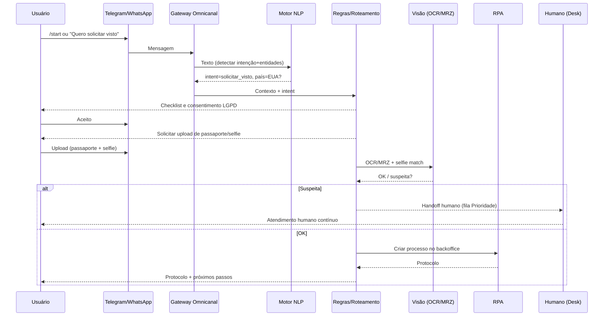

# Fluxos de Chatbot (Telegram & WhatsApp)

## 1) Intenção: Iniciar Solicitação de Visto

## 2) Falha de entendimento (Fallback)
- 1ª vez: reformular + sugestões de intenções.
- 2ª vez: oferecer **encaminhamento humano**.
- Sempre manter **token de continuidade** entre canais.
